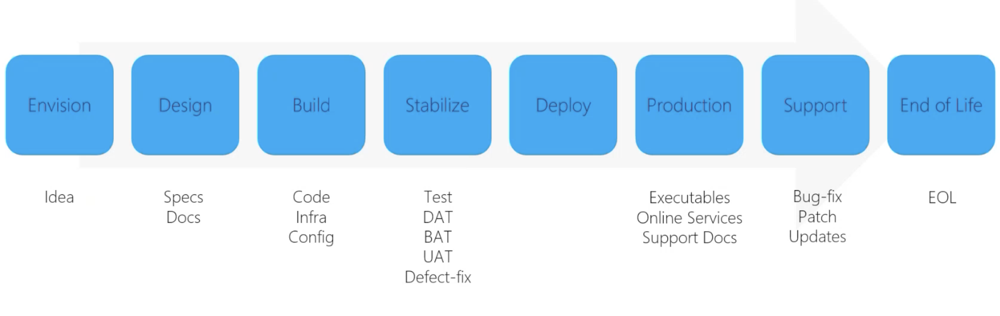
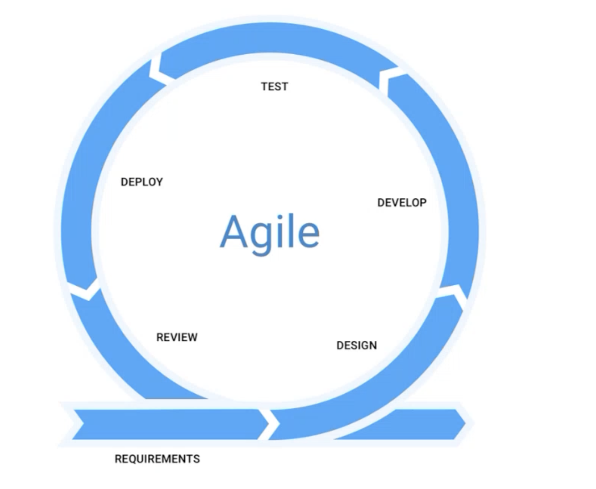
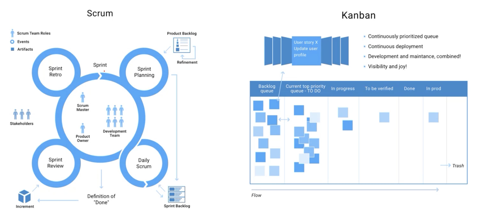
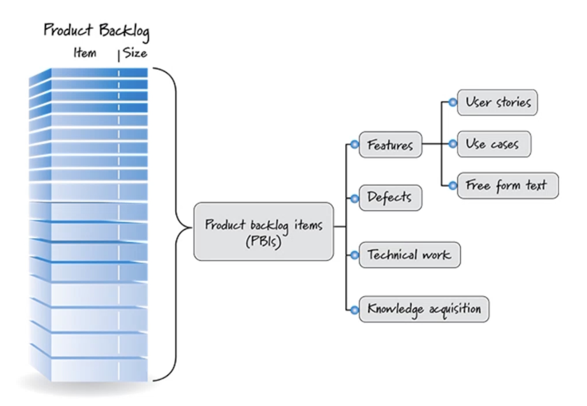

老师: Ray Ma (Azure)  </br>
时间: 2024/10/02 19:00  </br>
PPT: [查看](https://www.canva.com/design/DAF1herRIK4/OF18cKkhhVxODDkmHfmuXQ/view?utm_content=DAF1herRIK4&utm_campaign=designshare&utm_medium=link&utm_source=editor#1)

```
学习目标:
    为什么使用敏捷开发？
    什么是敏捷开发？
    什么是 Scrum？
    如何实践？
    真实案例
```

- [SDLC Model](#sdlc-model)
  - [Waterfall](#waterfall)
  - [V Model](#v-model)
  - [Agile](#agile)
    - [Agile (Modern) vs Waterfall (Traditional)](#agile-modern-vs-waterfall-traditional)
    - [Agile Values](#agile-values)
    - [12 Agile Principles Behind The Agile Manifesto](#12-agile-principles-behind-the-agile-manifesto)
- [Agile Methodologies 敏捷方法](#agile-methodologies-敏捷方法)
  - [Scrum](#scrum)
    - [Scrum 3355](#scrum-3355)
    - [Scrum Retrospective Meeting](#scrum-retrospective-meeting)
    - [Scrum Master -- Leader](#scrum-master----leader)
  - [Kanban](#kanban)
    - [Agile Backlog](#agile-backlog)
    - [Product Backlog Item - Under Scrum](#product-backlog-item---under-scrum)
    - [User Story - Under Agile](#user-story---under-agile)
  - [Daily Standup Meeting](#daily-standup-meeting)
    - [Task Estimation - 发生在Sprint Planning](#task-estimation---发生在sprint-planning)
- [Case Study](#case-study)
  - [Scenario Microsoft - Win10](#scenario-microsoft---win10)
  - [WasS](#wass)
  - [Teams](#teams)
  - [Self Forming Teams](#self-forming-teams)
  - [Spring Mail](#spring-mail)
- [Azure DevOps Lab Practice](#azure-devops-lab-practice)


## SDLC Model
项目管理（project management）的三大要素：Time、Scope and Budget。


SDLC (Software Development Life Cycle)是项目管理在软件分支的最基础的模型。软件开发生命周期 (SDLC) 是开发团队用来设计和构建高质量软件的经济高效且省时的过程。SDLC的目标是通过前瞻性计划将项目风险降至最低，从而使软件在生产期间及以后满足客户的期望。


作为DevOps员工，要思考我在DevOps的领域 和 Agile的环境中学到什么。分析团队的工作方式和优缺点，以及做的不好的内容和没有做的内容可以运用什么方法论和工具改进。注重方法论才知道接下来如何去做。不能只关注怎样做和用什么技术去做，回归理论知识上，要清楚自己要做什么，要知道团队需要什么。

主要有三种模型可供选择或适应您的流程，如下所示：

### Waterfall
瀑布模型-瀑布模型是一个顺序设计过程，通常用于软件开发过程，其中进度被视为在各个阶段中稳步向下流动（如瀑布）。项目的Project Management容易失败，三要素：On time, On budget, within Scope，有一点没满足及失败。在传统PM中使用waterfal，遵循流程开发，步骤无法go back。

### V Model
V 模型-V 模型代表软件开发过程，可以将其视为瀑布模型的扩展。编码阶段结束后，处理步骤不是以线性方式向下移动，而是向上弯曲，形成典型的 V 形状。

### Agile
《The Lean Starup》: MVP-持续创新和改进，类似于敏捷开发方式。敏捷项目管理是一种**迭代**开发方法论，重视人类的沟通和反馈，适应变化，并产生工作成果。




#### Agile (Modern) vs Waterfall (Traditional)

过去的员工职责非常清晰，项目中不同组别轮流进场，成员之间需要大量的Handover
注重流程，详细的工作文档
50% of knowledge gets lost in handoffs

敏捷开发要求不同的成员担任多个角色，比如需要devops做testing的工作，也需要团队成员有更广的知识面和更多的技能。

#### Agile Values
| Agile  | Waterfall  |
|---|---|
| Individuals and Iteractions  | Processes and Tools  |
| Working project  | Compressive Documentation  |
| Customer Collaboration  | Contract Negotiation  |
| Resonding to change  | Follow a Plan  |

Agile的原则是：减少浪费、快速迭代、不断迭代、交流沟通、响应变化

#### 12 Agile Principles Behind The Agile Manifesto
 1. Our highest priority is to satisfy the customer through early and continuous delivery of valuable software.
 2. Welcome changingrequirements, even late indevelopment. Agileprocesses harness change forthe customer's competitiveadvantage.
 3. Deliver working softwarefrequently, from a couple ofweeks to a couple of months,with a preference to theshorter timescale.
 4. Business people anddevelopers must worktogether daily throughoutthe project.
 5. Build projects aroundmotivated individuals. Givethem the environment andsupport they need, and trustthem to get the job done.
 6. Agile processes promotesustainable development. Thesponsors, developers, andusers should be able tomaintain a constant paceindefinitely.
 7. Working software is theprimary measure of progress.
 8. The most efficient andeffective method ofconveying information to andwithin a development team isface-to-face conversation.
 9. Continuous attention totechnical excellence andgood design enhances agility.
 10. Simplicity- the art ofmaximizing the amount ofwork not done -is essential.
 11. The best architectures,requirements, and designsemerge from self-organizingteams.
 12. At regular intervals, the teamreflects on how to becomemore effective, then tunesand adjusts its behavioraccordingly.

## Agile Methodologies 敏捷方法
Sprint冲刺，在每个Sprint周期内每个developer来领卡并完成。AU一般来说一个Sprint是 2 Weeks。


### Scrum
Scrum 是一个敏捷的项目管理**框架**，人们可以在其中解决复杂的问题，同时富有成效和创造性地交付尽可能高价值的产品。
Scrum 是：
- 用于实现业务敏捷性的轻量级工具
- 简单易懂，但难以掌握

#### Scrum 3355

| Role  | Artifacts  |  Events |  Value Propositions  |
|---|---|---|---|
| Product Owner - business people </br> Development Team - 开发 </br> Scrum Master - project manager（run流程）  | Product Backlog - 产品想要做的所有的东西（B+T） </br> Sprint Backlog - 选一些到Sprint里 </br> Increment - 交付物 | Sprint </br> Sprint Planning </br> Daily Scurm </br> Sprint Review </br> Sprint Retrospective |  Commitment  </br> Focus </br> Openness </br> Respect </br> Courage  |

#### Scrum Retrospective Meeting
**定义：** 回顾展是产品发货后举行的会议，讨论产品开发和发布过程中发生的事情，目标是在这些学习和对话的基础上改善未来的情况。

**回顾会议的理想结果是什么？**
每次回顾至少应列出 “进展顺利的事情” 和 “可能需要改进的事情” 的清单。这些清单可能不是特别长也不是特别详尽，但是每个项目的每一栏中可能都有一些突出项目。

#### Scrum Master -- Leader
- Scrum process mgmt.
- Effective communication
- Progress fracking
- Team protection
- Quaity check
- Team building

### Kanban
manage and track Sprint progress
从左到右有多个column代表任务所处阶段，一个任务叫做Workitem/Task/Ticket，任务的从左到右移动的过程叫做 **Swimming Lane**。
一般是单向的，特殊情况如 testing 和 review 没通过才会被拉回来。

#### Agile Backlog
Kanban上的任务一般都来自Product Backlog

**Product Backlog**：愿望清单，创建或增强产品所需交付的功能的有序列表，价值最高的物品和风险最大的物品应移至顶部。

**Sprint Backlog**：在Sprint中需要完成的任务，每个Sprint的开始时清空，每个Sprint结束时合并到Product Backlog。

#### Product Backlog Item - Under Scrum
PBIS (Product Backlog Item):


#### User Story - Under Agile
描述一个ticket的方法, 以该方式描述业务需求, User Story 分为不同的级别 对于不同的级别有不同的story point
- User Story = persona + need + purpose
e.g.: "As a [persona], I [want to], [so that]."
- Acceptance Criteria 验收标准

**Technical Debt：** As < technical debt>, I want < to be understood and prioritized appropriately > so that < we can maintain and improve the product without delay >.

**Bugs：** As a < bug>, I want < to be understood and prioritized appropriately> so that < problems are addressed early and the product is high quality >.

**Research：** As < research >, I want < to be understood and prioritized appropriately > so that < we can lower business risk and innovate >.

### Daily Standup Meeting
每天Run这个Meeting，快速讨论：1.昨天做了什么？2.今天做什么？3.需要帮助吗？
#### Task Estimation - 发生在Sprint Planning
**Planning Poker** 对任务投票，对task的难度达成内部共识。


## Case Study 

### Scenario Microsoft - Win10

### WasS
Windows as a Service - rings

Waterfall ---> Agile
Personal offices ---> team rooms
Long planning ---> continual planning & learninng
100 page spec doc ---> specs in PPT
4-6 month ---> 3 weeks sprint

### Teams
团队结构的变化
成员角色的变化

### Self Forming Teams
18个月可以换工作方向
保持团队的活跃度

### Spring Mail
邮件的形式开始或回顾每个Spring


## Azure DevOps Lab Practice
1. Open https://dev.azure.com
2. Login with your Microsoft Account or create a new account and login
3. Create a new organisation on your Azure DevOps
4. Configure your demo project environment (Task 1 only)
https://azuredevopslabs.com/labs/azuredevops/prereq/
5. Finish Azure DevOps Lab agile task https://azuredevopslabs.com/labs/azuredevops/agile/

