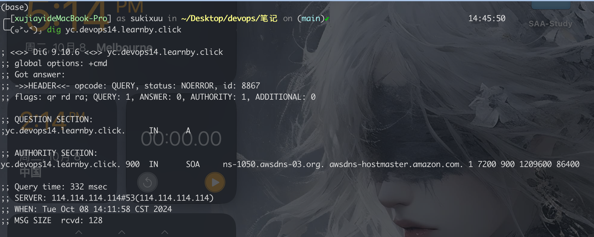

老师: William Wang  </br>
时间: 2024/10/03 19:00  </br>


```
第一部分: 知识回顾 (30 分钟)
    Agile Roles
    Sprint planning and agile methodology
    Git command basics

第二部分: 实操练习 (40 分钟)
    Task: Set up a GitHub account and understand basic git commands. Create SSH keys and link them to GitHub.
    Objective: Gain a foundational understanding of Git and SSH.

第三部分: 互动问答 (50 分钟)
    与学生进行互动，回答有关 Git 的问题。
    与学生进行互动，回答有关 Agile 的问题。

```

- [Homework](#homework)
  - [CDN](#cdn)
- [问题](#问题)
  - [dig 命令](#dig-命令)
    - [DNS Record](#dns-record)
  - [什么是 FinOps？](#什么是-finops)
- [Hands On](#hands-on)
- [Popular Linux CLI](#popular-linux-cli)
- [VSCODE plugin](#vscode-plugin)
- [Git](#git)


## Homework
### CDN
Q: https://github.com/australiaitgroup/DevOpsNotes/blob/main/WK1_CDN_DNS/homework.md
A: https://github.com/AutomationLover/Devops/blob/main/t02/Homework_DNS_CDN.md


## 问题
### dig 命令


SOA(start of authority): DNS 的授权起始 (SOA) 记录存储有关域或区域的重要信息，例如管理员的电子邮件地址、域上次更新时间以及服务器在两次刷新之间应等待多长时间。所有 DNS 区域都需要 SOA 记录才能符合 IETF 标准。

#### DNS Record

稍微了解过DNS工作原理的应该都听说过DNS查询的时候是可能要多次递归查询的，以www.gnu.org这个域名为例，正则的查询是先到根目录服务器上查找到org域名服务器的地址，然后到org域名服务器上查找到gnu.org域名服务器，然后再到gnu.org的域名服务器上查找www.gnu.org这个机器的IP地址。但是这里的描述忽略了一些重要的细节，这个递归查询/迭代到底是谁来查询的，是在客户端gethostbyname函数完成，还是由DNS server完成？如果是在域名服务器中完成，那么到底是在哪个域名服务器完成？同样是域名服务器，为什么有的只提供域名服务器的间接地址，而有的却不厌其烦的刨根问底，直到找到最终的目的IP地址？如果有gethostbyname在客户端完成，客户端抓包是不是可以看到很多往返来往的报文。

https://linux.cn/article-12509-1.html

DNS

1.Domin->IP
2.Local host
3.GW
4.Root
5.TOP
6.Auth

查询Google时，只有一条A记录，其实还有CNAME记录。CNAME(规范名称canonical name)就像一个别名，把一个域名指向另一个域名。你查询的大多数域名不会有CNAME记录，而只有A记录。如果你运行dig localhost命令，你会看到一个A记录，它就指向127.0.0.1。A记录用于将一个名字映射到一个IP地址。
DNS记录类型包括：

A或AAAA：IPv4或IPv6地址
CNAME：别名
MX：邮件交换器
NS：名称服务器
PTR：一个反向条目，让你根据IP地址找到系统名称
SOA：表示授权记录开始
TXT 一些相关文本
我们还可以在上述输出的第五行看到一系列的flags。RFC1035中定义了DNS报文头中包含的标志，甚至显示了报文头的格式。

### 什么是 FinOps？
FinOps是财务运营的缩写，是一种管理实践，旨在促进组织对云计算基础设施和成本的共同责任。
在 Finops 框架内，信息技术 (IT) 和 DevOps 小组与采购、财务和其他团队合作，解决整个组织的云成本问题。

## Hands On

https://github.com/AutomationLover/goexpert_handson/blob/main/w2/guide.md
可以直接用A Record 来指向 Bucket, 在创建Record的“Enter S3 endpoint“框输入Buket静态网站托管所给的网址的后半部分, AWS 会根据当前record的域名自动识别要访问的Bucket。
e.g: `http://www.sukixuu.click.s3-website-ap-southeast-2.amazonaws.com` 输入 `s3-website-ap-southeast-2.amazonaws.com`


## Popular Linux CLI
https://github.com/AutomationLover/Devops/blob/main/t02/PopularLinuxCommands.md


Mastering Linux commands is crucial for SRE (Site Reliability Engineering) or DevOps roles. 
Here are some examples: 

```
- sed 
    ```
    sed 's/foo/bar/g' filename # This replaces all occurrences of 'foo' with 'bar' in the file
    ```

- awk
    ```
    awk '{print $1}' filename # This prints the first field in each line of the file
    ```

- grep
    ```
    grep 'pattern' filename # This searches for the pattern in the file
    ```

- find
    ```
    find /home/user -name 'file.txt' # This searches for 'file.txt' in '/home/user' directory
    ```

- curl
    ```
    curl https://www.google.com # This fetches the HTML of Google's homepage
    ```

- ps
    ```
    ps aux # This displays the currently active processes
    ```

- netstat
    ```
    netstat -tuln # This displays network connections, listening ports, and the protocol used
    ```

- iptables
    ```
    iptables -L # This lists all the rules in the selected chain
    ```

- ssh
    ```
    ssh user@hostname # This connects to the hostas the specified user
    ```

- scp
    ```
    scp sourcefile user@hostname:destination # This copies the sourcefile to the destination directory on the remote host
    ```

- rsync
    ```
    rsync -av source_directory destination_directory # This syncs the source directory to the destination directory
    ```
```

## VSCODE plugin
https://github.com/AutomationLover/Devops/blob/main/t02/VSCode_extensions.md


## Git
https://github.com/AutomationLover/Devops/blob/main/t02/git.md


First, let's start with the basic operations of GIT:

1. **Git Clone**: This operation creates a copy of a repository.

   Example: `git clone https://github.com/username/repository.git`

2. **Git Add**: This operation adds a change in the working directory to the staging area.

   Example: `git add filename` or `git add .` to add all changes

3. **Git Commit**: This operation saves your changes to the local repository.

   Example: `git commit -m "Commit message"`

4. **Git Push**: This operation sends the committed changes of the local repository to a remote repository.

   Example: `git push origin master`

5. **Git Pull**: This operation fetches and merges changes on the remote server to your working directory.

   Example: `git pull origin master`

6. **Git Branch**: This operation allows you to create, list and delete branches.

   Examples: 
   - Create a new branch: `git branch new_branch`
   - List all branches: `git branch`
   - Delete a branch: `git branch -d branch_name`

7. **Git Checkout**: This operation switches branches or restoresworking tree files.

   Examples: 
   - Switch to an existing branch: `git checkout branch_name`
   - Create a new branch and switch to it: `git checkout -b new_branch`

8. **Git Merge**: This operation merges the specified branch’s history into the current branch.

   Example: `git merge branch_name`

Now, let's take a look at how you might handle a conflict during a merge:

1. First, let's create a new branch and make a change:

   ```
   git checkout -b feature_branch
   echo "This is some new feature." > feature.txt
   git add feature.txt
   git commit -m "Adding new feature"
   ```

2. Now switch back to master and make a conflicting change:

   ```
   git checkout master
   echo "This is a change on master." > feature.txt
   git add feature.txt
   git commit -m "Changing feature on master"
   ```

3. Try to merge feature_branch into master:

   ```
   git merge feature_branch
   ```

   You'll see a message that there's a conflict.

4. Open feature.txt and you'll see something like this:

   ```
   <<<<<<< HEAD
   This is achange on master.
   =======
   This is some new feature.
   >>>>>>> feature_branch
   ```

5. The part between `<<<<<<< HEAD` and `=======` is what's on the current branch (master), and the part between `=======` and `>>>>>>> feature_branch` is what's on the branch you're trying to merge (feature_branch).

6. To resolve the conflict, decide which part to keep, remove the other part along with the `<<<<<<< HEAD`, `=======`, and `>>>>>>> feature_branch` markers, and save the file. 

   For example, you decide to keep the change on master:

   ```
   This is a change on master.
   ```

7. After resolving the conflict, commit the changes:

   ```
   git add feature.txt
   git commit -m "Resolved merge conflict"
   ```

8. Now the merge conflict is resolved and you can push your changes to the remote repository:

   ```
   git push origin master
   ```

This is a very basic demonstration and in real projects, conflicts might be more complex. But the general process to resolve them is the same.


